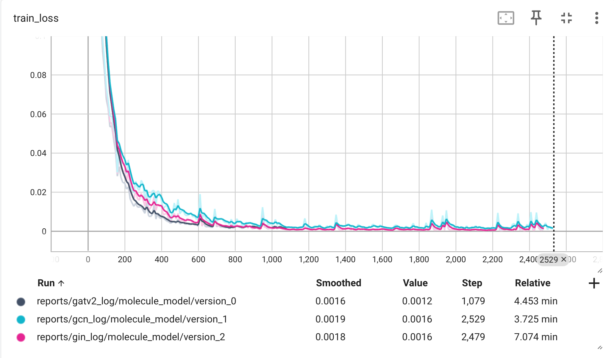
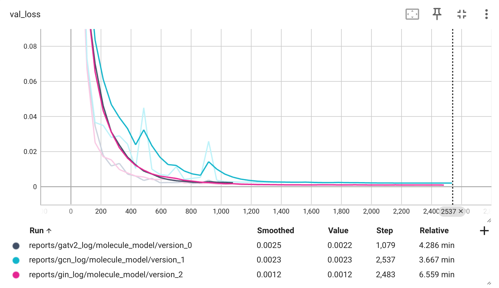

# ChemRar-test

Проект направлен на построение и оценку моделей машинного обучения для предсказания биологической активности молекул. Используются как графовые нейронные сети (GCN, GAT, GIN), так и модель XGBoost на основе молекулярных отпечатков (ECFP4).

## Структура проекта

```
├── README.md             <- Основной README-файл для разработчиков.
├── chemrar_test          <- Исходный код проекта.
│   ├── __init__.py       <- Делает chemrar_test Python-модулем.
│   ├── prepare.py        <- Скрипт для подготовки данных.
│   └── __pycache__       <- Кэшированные файлы Python.
│
├── data                  <- Данные проекта.
│   ├── processed         <- Обработанные данные, готовые для моделирования.
│   │   ├── data_graph.pt            <- Графовые данные, подготовленные для моделей.
│   │   ├── ecfp:4_features.parquet  <- Молекулярные отпечатки ECFP4.
│   │   └── random_split.csv         <- Разделение данных на тренировочные, валидационные и тестовые.
│   └── raw              <- Исходные данные.
│       └── data.csv     <- Исходные данные в формате CSV.
│
├── docs                  <- Документация проекта.
│   ├── task.md           <- Описание задания.
│   └── Тестовое_задание_хемо_ХимРар_август2024_2.pdf <- Тестовое задание.
│
├── models                <- Сохраненные модели и файлы с параметрами.
│   ├── best_model.xgb    <- Лучший обученный XGBoost.
│   ├── gatv2_model.pth   <- Модель GATv2.
│   ├── gcn_model.pth     <- Модель GCN.
│   └── gin_model.pth     <- Модель GIN.
│
├── notebooks             <- Jupyter ноутбуки для анализа данных и обучения моделей.
│   ├── 1-xgboost.ipynb           <- Ноутбук с обучением и анализом модели XGBoost.
│   ├── 2-graph_processing.ipynb  <- Предобработка данных для графовых нейросетей.
│   ├── 3-gat_model.ipynb         <- Ноутбук с обучением модели GAT.
│   ├── 4-gcn_model.ipynb         <- Ноутбук с обучением модели GCN.
│   └── 5-gin_model.ipynb         <- Ноутбук с обучением модели GIN.
│
├── reports               <- Отчеты и лог-файлы.
│   ├── figures           <- Графики и визуализации для отчетов.
│   ├── gatv2_log         <- Логи обучения модели GATv2.
│   ├── gcn_log           <- Логи обучения модели GCN.
│   ├── gin_log           <- Логи обучения модели GIN.
│   ├── xgb_model.xgb     <- Сохраненная модель XGBoost.
│   ├── xgb_model_metrics.json <- Метрики для модели XGBoost.
│   ├── xgb_params.json   <- Параметры для XGBoost.
│   └── xgboost.log       <- Лог-файл обучения модели XGBoost.
│
└── scripts               <- Скрипты для запуска и обучения моделей.
    ├── calc_features.py  <- Скрипт для расчета молекулярных отпечатков.
    ├── gat_model.py      <- Скрипт для обучения модели GAT.
    ├── gcn_model.py      <- Скрипт для обучения модели GCN.
    ├── gin_model.py      <- Скрипт для обучения модели GIN.
    ├── splitter.py       <- Скрипт для разделения данных.
    └── train_xgboost.py  <- Скрипт для обучения модели XGBoost.
```

## Описание запуска

### 1. Предобработка данных и разделение

Для начала работы необходимо выполнить предобработку данных и разделение данных на тренировочную, валидационную и тестовую выборки.

**Шаг 1: Разделение данных**

Запустите скрипт `scripts/splitter.py`, который разделит данные на тренировочные, валидационные и тестовые выборки:

```bash
python scripts/splitter.py
```

**Шаг 2: Предобработка данных**

Затем выполните предобработку данных и создание молекулярных отпечатков, а также подготовку данных для графовых нейросетей:

```bash
python scripts/calc_features.py
```

### 2. Обучение моделей

#### XGBoost:

Для обучения модели XGBoost используйте следующую команду:

```bash
python scripts/train_xgboost.py
```

#### Графовые нейронные сети (GAT, GCN, GIN):

Для обучения графовых нейронных сетей используйте следующие команды:

- **GATv2:**

  ```bash
  python scripts/gat_model.py
  ```

- **GCN:**

  ```bash
  python scripts/gcn_model.py
  ```

- **GIN:**

  ```bash
  python scripts/gin_model.py
  ```

### Структура и различия моделей

В проекте используются три графовые нейронные сети: **GATv2**, **GCN**, и **GIN**. Все модели имеют уникальные особенности, которые влияют на их архитектуру и процесс обучения.

1. **GATv2 (Graph Attention Network v2)**:
   - В этой модели на вход подаются как атомы, так и связи. Модель использует механизм внимания, который позволяет динамически взвешивать важность соседних узлов (атомов) и связей при обновлении признаков каждого узла.
   - Это делает GATv2 более гибкой в учете различных типов связей и их влияния на структуру молекулы.

2. **GCN (Graph Convolutional Network)**:
   - В GCN используется класс **`AtomEdgeInteraction`**, который объединяет признаки атомов и связей. Обновленные признаки затем проходят через графовую свертку, где усредняются признаки соседних узлов.
   - GCN эффективна для задач, где важно учитывать топологию графа, но без учета дифференцированных весов для каждого ребра.

3. **GIN (Graph Isomorphism Network)**:
   - Структурно GIN схожа с GCN, но делает акцент на более мощной функции агрегации для лучшего распознавания изоморфных графов.
   - В GIN также используется класс **`AtomEdgeInteraction`** для комбинирования признаков атомов и связей перед передачей через слои модели.

### Объединение признаков

- **GATv2** учитывает как признаки атомов, так и связи при помощи механизма внимания, что позволяет модели учесть влияние каждого ребра в контексте всей молекулы.
- **GCN** и **GIN** используют общий блок **`AtomEdgeInteraction`**, который объединяет признаки атомов и связей, после чего происходит обновление признаков узлов с помощью усреднения соседних узлов.

Эти особенности влияют на то, как каждая из моделей обучается и применяет полученные знания для предсказания биологической активности молекул.


## Результаты

В таблице ниже представлены результаты тестирования моделей XGBoost, GAT, GCN и GIN по ключевым метрикам классификации:

| Модель    | Accuracy      | Precision     | Recall        | F1-score      | ROC-AUC       | PR-AUC        |
|-----------|---------------|---------------|---------------|---------------|---------------|---------------|
| **XGBoost** | **0.999891**   | **0.984962**   | **0.994937**   | **0.989924**   | **0.998653**   | **0.995960**   |
| **GATv2**   | 0.999837      | **1.000000**   | 0.970000      | 0.984772      | 0.993926      | 0.982130      |
| **GCN**     | 0.999673      | **1.000000**   | 0.940000      | 0.969072      | 0.988425      | 0.980157      |
| **GIN**     | 0.999837      | **1.000000**   | 0.970000      | 0.984772      | 0.990904      | 0.983700      |

### Метрики:

1. **Accuracy (Точность)**: Процент правильно предсказанных наблюдений.
2. **Precision (Точность положительных предсказаний)**: Процент истинно положительных среди всех предсказанных положительных.
3. **Recall (Полнота)**: Процент верно найденных положительных среди всех истинных положительных.
4. **F1-score**: Среднее гармоническое Precision и Recall, баланс между ними.
5. **ROC-AUC**: Площадь под ROC-кривой, показывает способность модели различать классы.
6. **PR-AUC**: Площадь под Precision-Recall кривой, важна при несбалансированных данных.

### Графики потерь

Ниже представлены графики потерь для моделей GATv2, GCN и GIN.

**Train Loss**:


**Validation Loss**:


### Краткий анализ:

- **XGBoost** продемонстрировал наилучшие результаты по метрикам Accuracy, Recall, F1-score, ROC-AUC и PR-AUC, что делает его лидером среди всех моделей.
- **GATv2** и **GIN** показали одинаково высокие значения Precision, но несколько уступают XGBoost по метрикам Recall и F1-score.
- **GCN** также имеет высокие показатели, особенно по Precision, но в целом результаты немного ниже по сравнению с другими моделями.

### Заключение:

XGBoost продемонстрировал лучшие результаты среди всех моделей, что обусловлено тщательной настройкой гиперпараметров. Для графовых моделей подбор гиперпараметров не проводился, так как это потребовало бы значительных временных и ресурсных затрат.


Конечно, вот как можно кратко добавить информацию о структуре моделей и их различиях в отчет:

---

